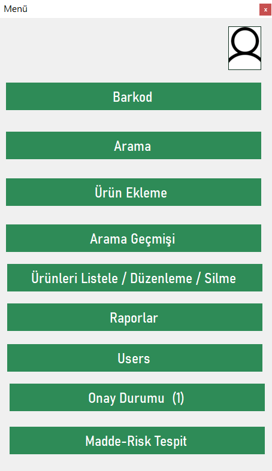
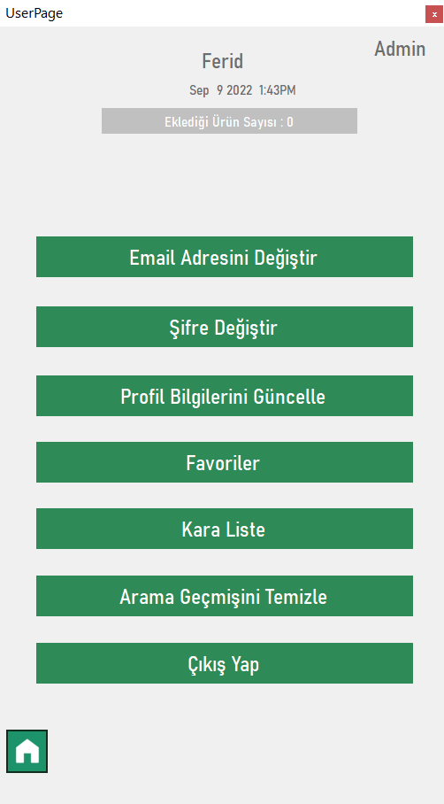
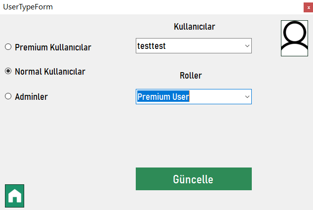
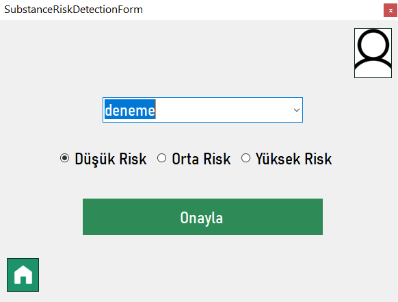
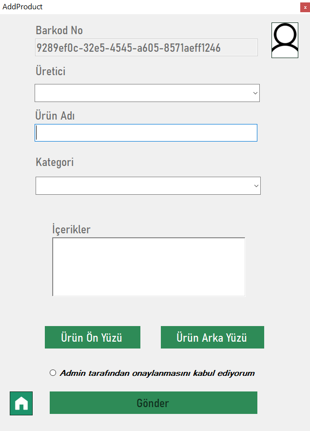

# Green Home Project
It is a Windows form application project. Various design patterns were used in the project. The project has been completed according to the layered architecture. Crud operations were performed using Linq and lambda queries.
# Used
- [x] Factory design pattern.
- [x] Singleton design pattern.
- [x] Repository design pattern.
- [x] Unit of Work design pattern.
- [x] Linq-lambda queries.
- [x] Mssql. 
- [x] Layered architecture

Some screenshots from the app.

 
